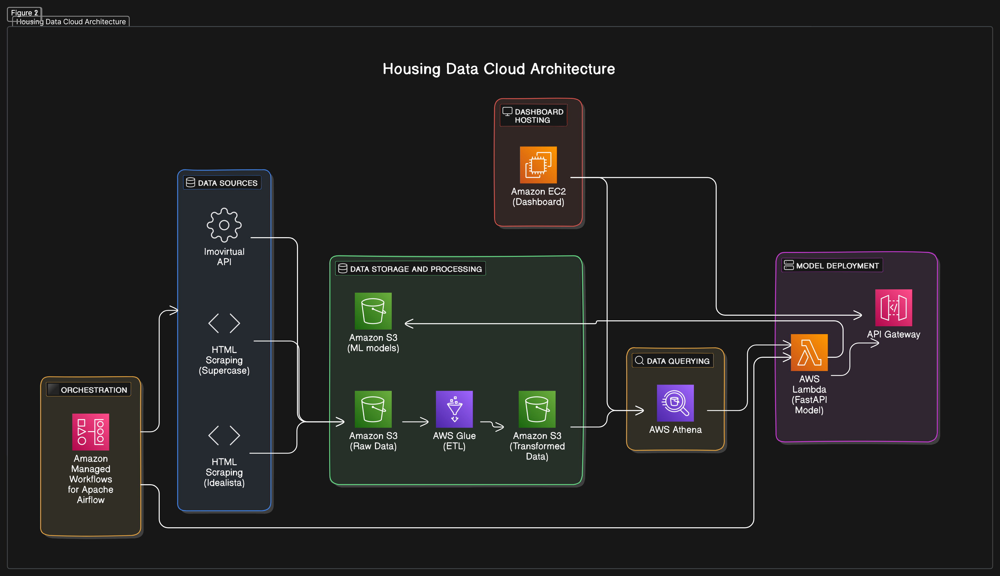

# Airflow DAGs for Web Scraping and Data Processing

Use cases:
- Scrape raw data from source 
  - idealista scrape html files from a data catalog previously built to show the hierarchy between locations
  - imovirtual uses a reverse engineering of the graphql endpoint to get data from major locations
- Parse raw data into semi structured formats
  - idealista parses data into a flatten dataframe using lxml
  - imovirtual parses data into a flatten dataframe
- Upload the data to S3

## Cloud Architecture



**Fast API repo**: https://github.com/miguelsiloli/housing_prices_fastapi
**Dash repo**: https://github.com/miguelsiloli/housing_scrapper

1. Activity Diagram

```
+---------------------+
|      Start          |
+---------------------+
          |
          v
+---------------------+
|  Start Scraping     |
+---------------------+
          |
          v
+---------------------+
| Store HTML Locally  |
+---------------------+
          |
          v
+---------------------+
| Convert HTML to     |
| Parquet             |
+---------------------+
          |
          v
+---------------------+
| Upload Parquet to S3|
+---------------------+
          |
          v
+---------------------+
|         End         |
+---------------------+
```

## Overview

This repository contains two Airflow DAGs for scraping real estate data from Idealista and Imovirtual, processing the data, and uploading it to an AWS S3 bucket.

## Project Structure

- `idealista_dag.py`: DAG for scraping and processing Idealista data.
- `imovirtual_dag.py`: DAG for fetching and processing Imovirtual data.
- more to be added

## Prerequisites

- Python 3.8+
- Apache Airflow
- AWS account with S3 access
- Required Python packages (specified in your environment setup)

## Setup

1. **Clone the repository**:
   ```bash
   git clone url.git
   cd directory

2. **Set env variables on .env file**:
  
aws_access_key_id
aws_secret_access_key
region_name


## Setup

Idealista DAG (idealista_dag.py)

    Description: Scrapes data from Idealista, processes the data, and uploads it to an S3 bucket.
    Schedule: Runs daily at 12 PM.

Tasks:

    Scrape Idealista:
        Uses a custom scraper to fetch data from provided URLs.
        URLs are read from district_data_updated.csv.
    Parse Data:
        Parses the scraped HTML files and converts them to a DataFrame.
        Uploads the parsed data to an S3 bucket.
    Delete Raw Data:
        Deletes the local folder containing raw HTML files after processing.

## Notes

### Data Engineering Workflow:

- Create a scraper and store raw data
  - Output store it either locally or in s3 bucket
- Create a parser to parse raw data into semi-structured format
  - Optimize parser (cProfile)
  - Create tests for the output data
  - Output store it in s3 bucket
- Wrap up with workflow orchestration tool
  - Define DAGs (Directed Acyclic Graphs) to manage the workflow sequence: scraping, parsing, optimizing, and testing.
  - Monitor the workflow
- Wrap up with container
- Deploy to cloud

#### Data schema

1. Raw layer (datatype = source)
2. Unnormalized Semi-structured format (data lake with parquet format)
   1. At this point its important to decompose into logical and simple tasks
3. Normalize into star schema
4. (Optional) Create SCD to track changes to listing prices if required

#### Unnormalized

| Column              | Type    | Description                                             | Constraints             |
|---------------------|---------|---------------------------------------------------------|-------------------------|
| `title`             | String  | URL of the property listing.                            | Non null.    |
| `link`              | String  | Direct link to the property listing.                    | Must be a valid URL.    |
| `description`       | String  | Description of the property.                            | None                    |
| `garage`            | Boolean | Indicates whether the property includes a garage.       | True/False values       |
| `price`             | Integer | Price of the property in euros.                         | Greater than zero.      |
| `home_size`         | String  | Describes the type of home, e.g., T1, T2, etc.          | Matches "T\d+" pattern. |
| `home_area`         | Integer | The area of the home in square meters.                  | Greater than zero.      |
| `floor`             | Integer | The floor number on which the property is located.      | Any integer.            |
| `elevator`          | Boolean | Indicates whether the building has an elevator.         | True/False values       |
| `price_per_sqr_meter` | Float | Calculated price per square meter.                     | Greater than zero.      |
| `date`              | Date    | The date associated with the data record.               | Valid date format.      |

## Star Schema Overview

### Fact Table

- **FactPropertyListings**
  - `listing_id` (PK)
  - `date_id` (FK)
  - `property_id` (FK)
  - `location_id` (FK)

### Dimension Tables

- **DimDate**
  - `date_id` (PK)
  - `day`
  - `month`
  - `year`
  - `weekday`

- **DimProperty**
  - `property_id` (PK)
  - `title`
  - `link`
  - `description`
  - `home_size`
  - `price`
  - `home_area`
  - `price_per_sqr_meter` (derived)

- **DimLocation**
  - `location_id` (PK)
  - `floor`
  - `elevator`
  - `garage`
  

### SCD 2 on table DimProperty

- **DimProperty**
  - `property_id` (PK)
  - `title`
  - `link`
  - `description`
  - `home_size`
  - `price`
  - `home_area`
  - `price_per_sqr_meter` (derived)
  - `version` (int)
  - `start_date` (date)
  - `end_date` (date)
  - `is_current` (boolean)

Something like this (PLSQL)

For each new row:
- Compare with current valid by PK
- If some field doesn't match, update fields and + 1 Version
- Else return

```plsql
-- Adding new columns to handle SCD2
ALTER TABLE DimProperty
ADD COLUMN version INT,
ADD COLUMN start_date DATE,
ADD COLUMN end_date DATE,
ADD COLUMN is_current BOOLEAN;

-- Example SQL to insert or update records in DimProperty
CREATE OR REPLACE PROCEDURE update_property (
    p_property_id INT,
    p_title TEXT,
    p_link TEXT,
    p_description TEXT,
    p_home_size TEXT,
    p_price DECIMAL,
    p_home_area INT,
    p_price_per_sqr_meter DECIMAL,
    p_effective_date DATE
)
LANGUAGE plpgsql
AS $$
BEGIN
    -- Check if the current version exists and is different from the new data
    IF EXISTS (
        SELECT 1 FROM DimProperty
        WHERE property_id = p_property_id AND is_current
        AND (title != p_title OR link != p_link OR description != p_description
             OR home_size != p_home_size OR price != p_price 
             OR home_area != p_home_area OR price_per_sqr_meter != p_price_per_sqr_meter)
    ) THEN
        -- End-date the current version
        UPDATE DimProperty
        SET 
            end_date = p_effective_date - INTERVAL '1 day',
            is_current = FALSE
        WHERE property_id = p_property_id AND is_current;

        -- Insert the new version
        INSERT INTO DimProperty (property_id, title, link, description, home_size, price, home_area, price_per_sqr_meter, version, start_date, end_date, is_current)
        VALUES (p_property_id, p_title, p_link, p_description, p_home_size, p_price, p_home_area, p_price_per_sqr_meter, 
                (SELECT COALESCE(MAX(version), 0) + 1 FROM DimProperty WHERE property_id = p_property_id),
                p_effective_date, '9999-12-31', TRUE);
    END IF;
END;
```

## Data Science: Home rent price regression

without feature engineering, preprocessing or hyperparam optimization

{'mean_squared_error': 2929246.7553236005,
 'root_mean_squared_error': 1711.5042376002464,
 'mean_absolute_error': 866.0751354859858,
 'median_absolute_error': 333.6544158785764,
 'r2_score': 0.7170226207127227,
 'mean_absolute_percentage_error': 0.290143700790773,
 'explained_variance_score': 0.7176638983900725,
 'max_error': 12942.886190195217}

 after feature engineering, preprocessing and hyperparam opt

 {'mean_squared_error': 602776.7700695128,
 'root_mean_squared_error': 776.386997617498,
 'mean_absolute_error': 367.0216836685397,
 'median_absolute_error': 134.60877328493183,
 'r2_score': 0.8398658418155807,
 'mean_absolute_percentage_error': 0.1605847610960246,
 'explained_variance_score': 0.8400642395176007,
 'max_error': 7916.031221418012}


 Note: it is still possible to achieve better results by including new features. Some of those features could be accessible such as number of pictures and feature extraction from the description.
 Another easier way to achieve better results would be to parse individual listings instead of the searching page. It has info about:
 - energy efficiency
 - number of bedrooms 
 - number of bathrooms
 - if its equiped with appliances and so on
 - current state of the house (deprecation)

I think with these infos we could get up to 90% R2 and MAPE < 10%.
Increasing the size of the dataset should help as well!